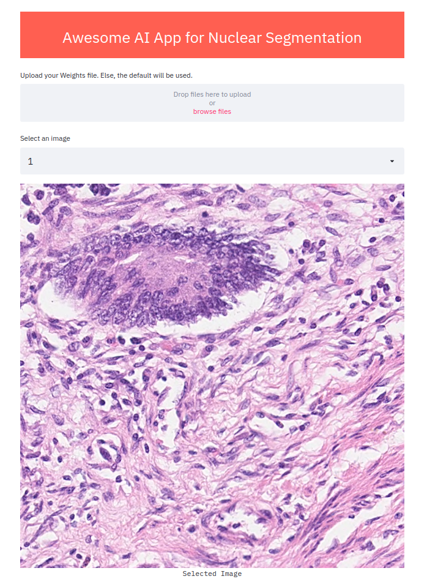

# AwesomeAiApp

## Prerequisites
- Python 3.6 and above
- Recommended to use a virtualenv for managing packages

## Running Application
- Install all packages
`pip install -r requirements.txt`
- Run application
`streamlit run awesome_app.py`

## Using the GUI
- If you have a customs weights file you want to use for prediction, upload it. Else, the default pre-trained one will be used.
- Select 1 out of 14 images to predict.
- Press the predict button to run predictions.

## Training your own model
- To train the model and generate training results and your own custom weights, run
`python nuclei_main.py`

## Contributors
- **Eugene (1002060)**
- **Hong Pengfei (1002949)**
- **Lu Jiankun (1002959)**
- **Peng Shanshan (1002974)**
